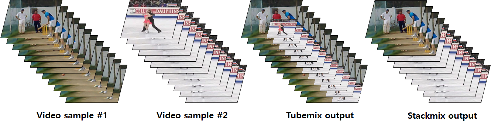
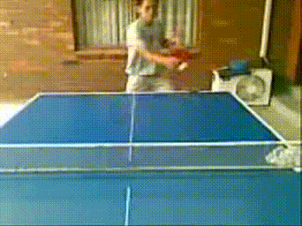
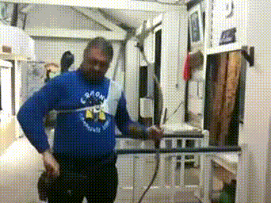
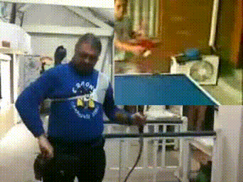
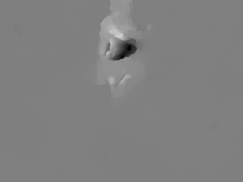
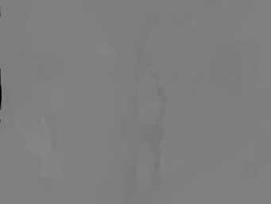
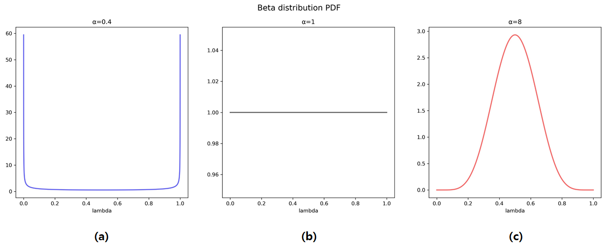

# videomix
Implementation of brand new video augmentation strategy for video action recognition with 3D CNN.

- reference
  - videomix paper: https://arxiv.org/abs/2012.03457
  - pytorch-i3d(basic video transformation code): https://github.com/piergiaj/pytorch-i3d

</img>

Tubemix is like a 'video-in-video' augmentation, and Stackmix is 'video-to-video'. Use videomix.py to implement Tubemix and Stackmix.

## Example

rgb "TableTennis"             |  rgb "Archery"
:-------------------------:|:-------------------------:
|

rgb stackmix             |  rgb tubemix
:-------------------------:|:-------------------------:
|

opt flow-u "TableTennis"             |  opt flow-u "Archery"
:-------------------------:|:-------------------------:
|

opt flow-u stackmix             |  opt flow-u tubemix
:-------------------------:|:-------------------------:
|

## Experimental Result
Training on I3D with Stackmix and Tubemix augmentation.

\* *RCRF* represents applying random crop and random flipping
Probability of implementing Stackmix or Tubemix is fixed to p=0.5.

I've also explored how beta distribution effect on training accuracy. Figure below shows the PDF of &\lambda$~beta(α,α).

</img>
- UCF-101

|Augmentation method|hyper-parameter|Spatial Stream|Temporal Stream|
:-------------------------:|:-------------------------:|:-------------------------:|:-------------------------:
|Baseline(RCRF)|-|93.23%|91.36%|
|Tubemix|α=8|93.97%|92.23%|
|Tubemix|α=0.4|93.74%|93.02%|
|Tubemix|α=2|93.52%|92.55%|
|Stackmix|α=8|94.23%|92.68%|
|Stackmix|α=0.4|**94.29%**|93.05%|
|Stackmix|α=2|94.00%|92.84%|
|Stackmix|α=1|93.97%|**93.34%**|

- HMDB-51

|Augmentation method|hyper-parameter|Spatial Stream|Temporal Stream|
:-------------------------:|:-------------------------:|:-------------------------:|:-------------------------:
|Baseline(RCRF)|-|**74.97%**|75.62%|
|Tubemix|α=8|74.05%|76.80%|
|Tubemix|α=0.4|74.31%|77.12%|
|Tubemix|α=2|73.79%|76.99%|
|Tubemix|α=1|74.71%|77.06%|
|Stackmix|α=8|73.59%|76.80%|
|Stackmix|α=0.4|74.05%|**77.25%**|
|Stackmix|α=2|74.58%|76.21%|
|Stackmix|α=1|73.99%|75.88%|

Apply on UCF-101, Stackmix and Tubemix could derive performance improvement(+1~2%) with UCF-101 datasets in both streams. However, when applied to HMDB-51, the performance of temporal stream was improved, but the performance of spatial stream was rather reduced.

### Future work
- Speed jittering augmentation is work in progress.

